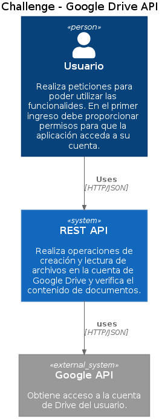
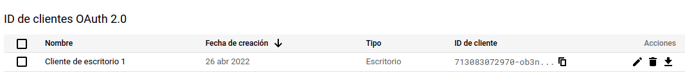
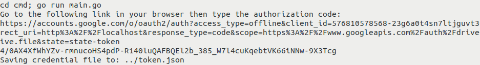
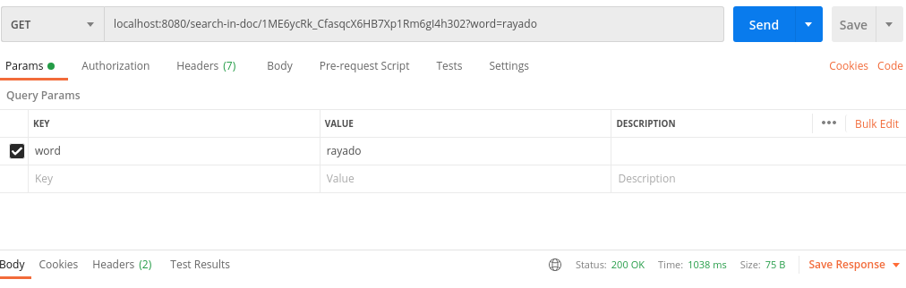
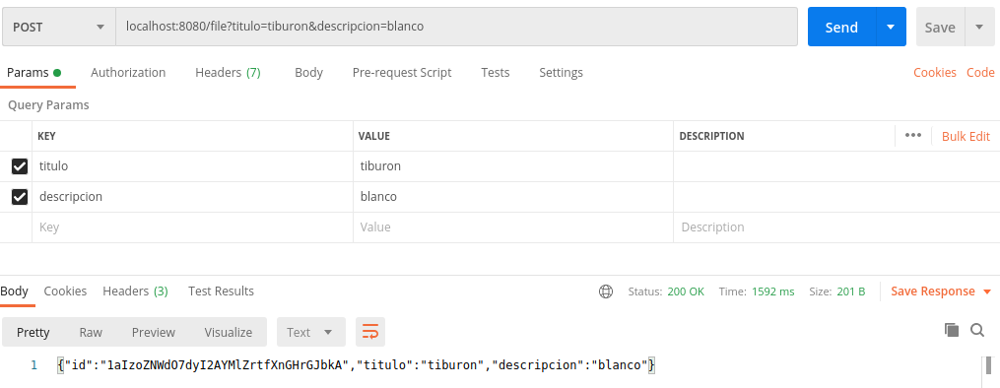

# Challenge MELI - Google Drive 

## Descripción
Esta es una aplicación realizada como ejercicio de entrevista. El código está escrito en Go. Es un servidor que recibe peticiones HTTP.
Se contemplaron los requerimientos de la consigna. La arquitectura de la aplicación es simple.

## Aplicaciones utilizadas
- Go v1.17
- Curl
- Postman
- Make 
- Docker 
- Docker Compose 

## Diagramas



## Modo de uso
### Crear credencial en la consola de Google
Para utilizar el programa se necesitar utilizar la API  de google por lo que se debera decargar credenciales. Se puede seguir este link para mas detalles ...

### Uso de comandos mediante Make
Se requiere tener Make instalado.

#### Correr el servidor
Permite correr el servidor sin necesidad de compilarlo.
```
make go-run
```
#### Ejecutar las pruebas
Ejecuta todos los tests disponibles en el proyecto. 
```
make test
```
#### Compilar programa
Permite compilar el código del programa, generando un binario que se guarda en cmd/server.
```
make build
```
#### Correr contenedor de Docker
Permite ejecutar el programa usando Docker.
```
make run-compose
```
#### En ejecución
Ya sea al correr con cualquiera de las formas el programa, la primera vez se necesitará seguir un link desde la terminal para iniciar sesión y obtener un código de autorización, el cual se ingresara por la linea de comandos. Una vez realizado este paso no se volvera a solicitar ya que el token se almacena en un archivo de formato JSON. 


### Prueba con Cliente HTTP
Una vez ejecutado el servidor, para poder probarlo se necesita algún programa como Curl o Postman. En el caso de usar Curl debe estar instalado, aunque viene por defecto en muchas distribuciones de Linux.
Lo que sigue es ejecutar una solicitud similar a la que sigue:

#### Buscar archivo con curl
```
curl --location --request GET 'localhost:8080/search-in-doc/{ID}?word=rayado' \
--data-raw '' -v
```
#### Crear archivo con curl
```
curl --location --request POST 'localhost:8080/file?titulo=tiburon&descripcion=blanco' -v
```
En caso de usar Postman se debe realizar una solicitud como la que se muestra en la imagen.

#### Buscar archivo con Postman

#### Crear archivo con Postman


